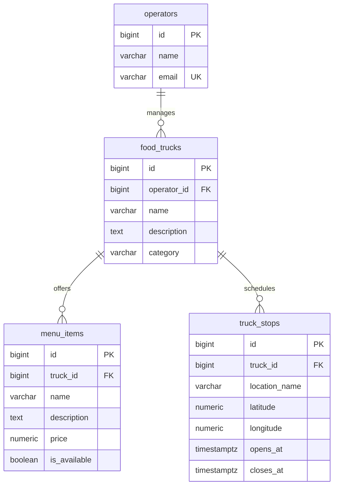

# SCRUM-24: Initial database schema

This design supports consumer truck discovery, truck profiles, menus, and basic
operator ownership. `schema.sql` is a PostgreSQL 15 review draft. It has not been
applied to the development database and is not wired into application startup.

## Relationships

An operator can manage multiple trucks. Each truck has exactly one operator for
this first version; shared management is not implemented. A truck may have no
menu items or scheduled stops yet.

## What the fields mean

| Table | Purpose | Main rules |
| --- | --- | --- |
| `operators` | Operator name and contact email | Email is unique ignoring capitalization and surrounding spaces. This is not yet a login account. |
| `food_trucks` | Truck profile | One required operator, name, and category; description is optional. |
| `menu_items` | Items sold by a truck | Required name and nonnegative USD price; availability defaults to true. |
| `truck_stops` | A truck's scheduled visit to a location | Required location and opening/closing timestamps; closing must follow opening. Coordinates are optional but must be supplied together. |

A primary key (`id`) identifies a row. A foreign key (`operator_id` or `truck_id`)
links a row to its owner. PostgreSQL generates IDs automatically. Indexes on these
links help retrieve an operator's trucks and a truck's menu or stops.

Prices use exact decimals, such as `8.99`. The frontend adds the dollar sign.
Stops use timestamps with time zones rather than text such as `3:00 PM`, so each
visit has a date and can cross midnight. Send timestamps with an explicit offset
and format them in the intended display time zone. PostgreSQL stores the instant,
not the original named time zone.

Deletion is restricted when dependent rows exist, avoiding accidental removal of
a truck's menu or schedule. A future deletion/archive workflow needs its own design.

## Connection to the current frontend

| Current sample field | Database source |
| --- | --- |
| `id`, `name`, `category` | `food_trucks` |
| `location` | Selected stop's `location_name` |
| `closingTime` | Selected stop's `closes_at`, formatted for display |
| `menu` | `menu_items` filtered by `truck_id` |

Discovery will need an explicit rule for selecting the current or upcoming stop.
Show “Open until” only during that stop's opening interval. The current sample
closing times lack dates, so do not automatically convert them into real schedules.

## Scope and next implementation step

This is an initial design, not the full BiteMap database. Authentication, consumer
accounts, orders, payments, recurring schedules, and shared operator access remain
separate work. One category per truck and USD prices are initial assumptions.
Overlapping stops are not prevented by this draft; validate scheduling conflicts
when the operator scheduling feature is implemented.

Review these relationships with the team, then integrate a versioned migration
tool such as Flyway and test the schema in a disposable PostgreSQL database before
applying it locally. Keep Spring's `ddl-auto: validate`: it checks entities against
the schema instead of silently creating or modifying tables. Do not run this draft
against an existing database without first inspecting its schema.
