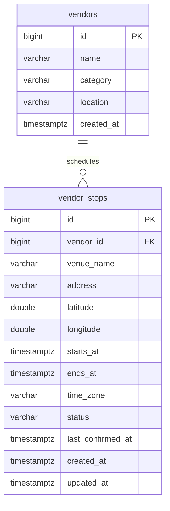
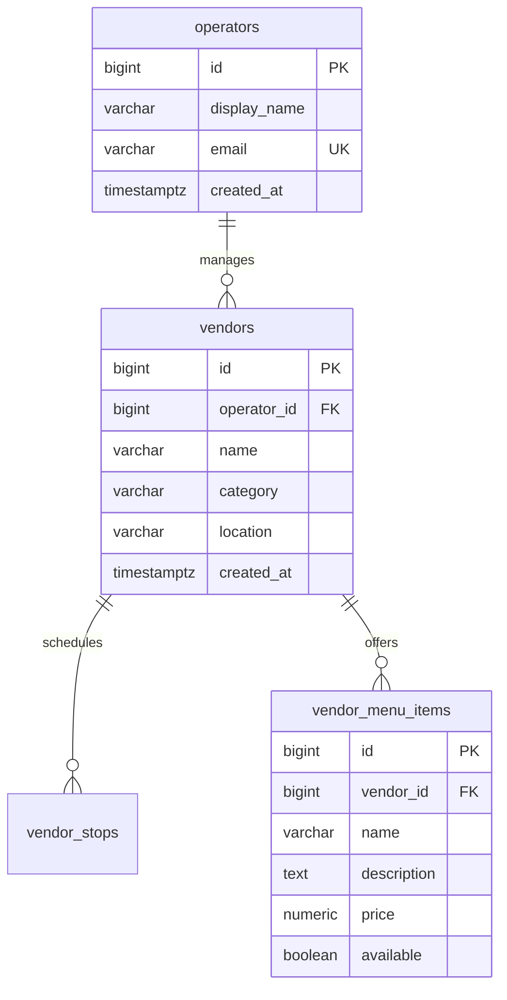

# SCRUM-24: Initial database schema

BiteMap uses PostgreSQL and Flyway. The schema is built by the versioned files in
`Backend/src/main/resources/db/migration`; this document is a readable map of
those migrations. It is not a second schema initializer.

## Current schema

The `vendors` table stores the truck information used by discovery. A vendor may
have many dated stops. Each stop belongs to exactly one vendor through
`vendor_stops.vendor_id`.

| Migration | Purpose |
| --- | --- |
| `V1__create_vendors.sql` | Creates the discovery table. |
| `V2__strengthen_vendor_required_fields.sql` | Rejects blank vendor fields. |
| `V3__create_vendor_stops.sql` | Adds dated locations, coordinates, hours, and status. |

The SCRUM-31 branch also proposes `vendor_menu_items`. That migration must be
merged and its version coordinated before the ownership migration is numbered.

## Planned operator ownership

The agreed relationship is one operator to many trucks, while each truck has one
operator. The next ownership design should extend the existing `vendors` table:

Do not create a separate `food_trucks` table; `vendors` already represents food
trucks throughout the backend and frontend. Adding `operator_id` immediately as
required would break existing vendors, including development fixtures. The safe
implementation sequence is:

1. Decide whether an operator is also the future login account or a business
   profile linked to an account.
2. Add `operators` and a nullable `vendors.operator_id` in a new migration.
3. Add real operator records and assign every existing vendor.
4. In a later migration, make `operator_id` required after verifying that no
   vendor remains unassigned.

An operator email should be unique without regard to capitalization. Authentication,
passwords, roles, and invitations are outside this schema ticket and must not be
stored as plain text fields here.

## Rules for the next migration

- Pull the latest `main` and coordinate the next Flyway version with teammates.
- Never edit a versioned migration after teammates have applied it.
- Test both a fresh database and an upgrade containing existing vendors.
- Keep development fixtures separate from production migrations.
- Keep Hibernate on `ddl-auto: validate`; Flyway owns schema changes.

See [database migration workflow](../database-migrations.md) for commands and
safety rules.
